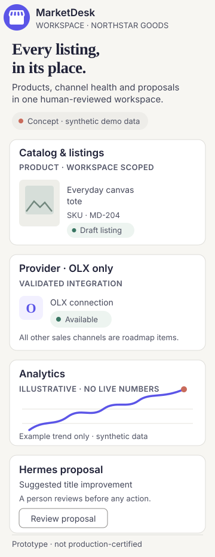

<div align="center">

# MarketDesk

**One workspace for seller operations: products, marketplace listings, analytics, and reviewable AI assistance.**

Project status: [prototype, not production-certified](.github/project-status.yml)

</div>

<p align="center">
  
</p>

*Designed concept; all interface data is synthetic. See the [editable design source and provenance](docs/design/readme-showcase/README.md).*

[View the wide desktop concept](docs/design/readme-showcase/marketdesk-readme-hero.svg) · [View its editable HTML source](docs/design/readme-showcase/marketdesk-readme-source.html)

MarketDesk is a workspace-scoped product and listing management platform. **OLX is the only validated real marketplace integration**; other channels are roadmap surfaces. Hermes recommendations require human review and guarded execution—not unattended automation. This project is a prototype, not production-certified.

## What you can do

- **Manage a product catalog** and prepare marketplace listings from one workspace.
- **Review listing and provider state** without confusing local drafts with marketplace truth.
- **Track operations and analytics** across current product/listing workflows.
- **Use Hermes-assisted recommendations** as proposals to inspect, approve, or dismiss.

## Get started

Requires Node.js 22+ and npm 10+. For local Compose, configure `.env` first:

```bash
git clone https://github.com/quokkify/marketdesk.git
cd marketdesk
npm ci
cp .env.example .env
# Set DB_SSL_MODE=disable, JWT_SECRET, and HERMES_API_KEY in .env
docker compose up -d
curl -fsS http://127.0.0.1:3000/health
curl -fsS http://127.0.0.1:3000/ready
```

The app requires a native Hermes Agent API Server; its key must match `HERMES_API_KEY`. Restrict the Hermes host port with firewall/security-group rules to Docker traffic and trusted administrators. Compose runs upload initialization and database migrations before the app starts. For development without Docker, start local PostgreSQL and Redis, configure `.env`, then use `npm run dev`.

See [Development and operations](docs/development.md) for environment setup, checks, the network boundary, data safety, and troubleshooting. Never delete Compose volumes that contain data you need.

## Architecture

React + TypeScript frontend · Node.js + Express API · PostgreSQL · Redis · Docker Compose. Backend responsibilities follow domain, application, infrastructure, and presentation layers. The standard Compose deployment builds a **single combined application image** serving the API and SPA.

## Documentation

- [Product/spec source hierarchy](docs/spec/README.md) · [Product maturity](docs/spec/PRODUCT.md) · [Traceability](docs/spec/TRACEABILITY.md)
- [Canonical architecture](ARCHITECTURE.md) · [Original product requirements](docs/design/MarketDesk%20PRD.dc.html) · [Visual prototype](docs/design/MarketDesk.dc.html)
- [Existing product, analytics and dark-theme screenshots](https://github.com/quokkify/.github/tree/main/assets/projects/marketdesk) (visual references; not production-readiness claims)
- [Development and operations guide](docs/development.md)
- [Caddy + Cloudflare deployment](docs/deployment/caddy-cloudflare-vps.md) · [Release and migration safety](docs/deployment/release-version.md)
- [Upload storage](docs/deployment/upload-storage.md) · [GHCR image contract](docs/deployment/container-images.md)
- [OLX publication quota guard](docs/olx-publication-quota.md) · [Hermes agent boundary](docs/marketdesk-agents.md)

## Maturity and contribution

MarketDesk is actively evolving; implemented surfaces and remaining acceptance gaps are tracked in [TRACEABILITY.md](docs/spec/TRACEABILITY.md). Product behavior and maturity rules are documented in [PRODUCT.md](docs/spec/PRODUCT.md). The prototype and screenshots are design references, not proof of production readiness.

Contributions should include focused tests and documentation updates where behavior changes. Open a pull request using the repository template. Do not publish, relist, or mutate real marketplace data without explicit authorization.
